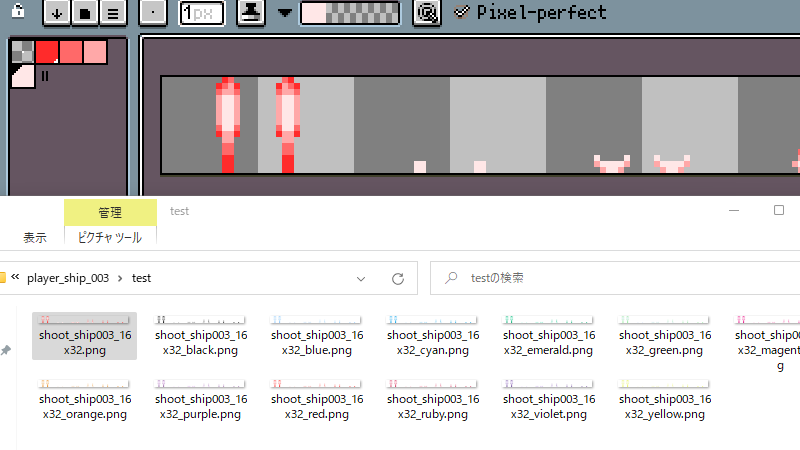
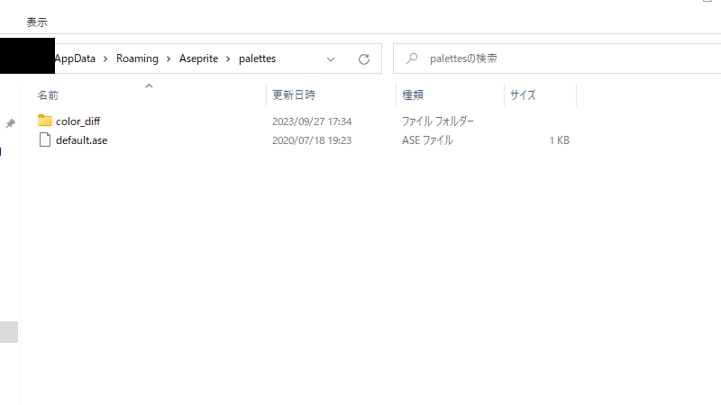
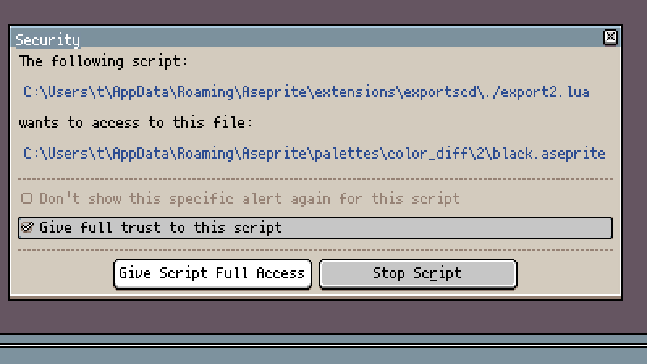
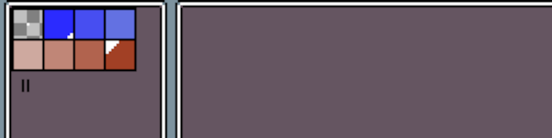
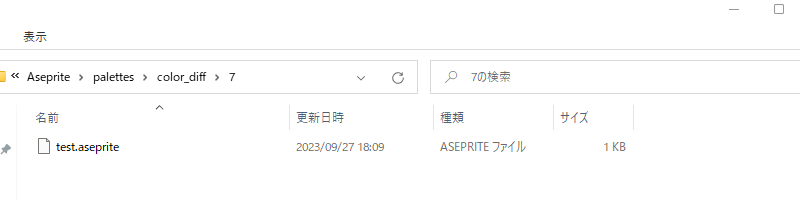

# Export Sprite Color Difference



It's simply sprite export option of [Aseprite](https://www.aseprite.org/).

Loads another palette information into sprites created in index format and outputs them all at once.

<span style="color: red; ">Cannot be used for sprites created in non-indexed formats.</span>

<span style="color: red; ">Since the scripts perform file operations, trust permissions must be granted to use the scripts.</span>

<span style="color: red; ">Use at your own risk.</span>

-----

## How to Use

Open `Edit > Preferences > Locate Configuration File` and move the `color_diff` folder in the same folder as this README under the palettes folder.



Install export-scd.aseprite-extension

After installing the extension, `File > Export > Export Sprite Color Difference` select the export you want to use.

Due to software limitations, you must grant trust permission to the script when using it.

When the setting is completed, the color difference of the sprite according to the condition is output to the same folder as the sprite with a qualifier in the name.



<span style="color: red; ">PNG files output by this method do not check for file overwrites.</span>

See below for the differences in export type.

-----

## Export type

### Auto Index Size
This export type is rarely used when working with simple gradients.

You should use Auto Gradation export type.

Select a palette that automatically adapts according to the number of indices in the sprite.

This extension contains only a 2 colors + 1 background color palette.

If you want to use this Export type with a palette with a larger number of colors, you will need to create and save the palette yourself.

Check `How to add palettes` for more information.

-----

### Auto Gradation
This Export Type is Suitable for simple gradients.

Gradient is automatically calculated from a two-color palette according to the number of sprite indexes and output as a PNG file.

The 12 test palettes included with this extension allow you to try them out right away.

Of course, you can add your own palettes by following the steps in `How to add palettes`.

Add 2 colors + 1 background color palette file under `color_diff/2`.

-----

### Select Folder
This Export type allows you to choose your own palette folder to use.

Selecting one of the palettes in a folder that contains the palettes you want to use for color difference output will use all the palettes in that folder.

This can be used when you have a palette that you want to use only for a specific sprite, such as a player character of a different color.

When using this Export type, carefully check that the sprite and palette have the same number of indices.

This may cause unexpected errors.

-----

## How to add palettes
Create a palette of the colors you want to add in Aseprite and save it from `Save Palette` for `color_diff` folder.

The following seven file types can be read with this extension.

``````
ase aseprite png act gpl hex pal
``````

The palette should be saved in the same folder as the number of colors excluding the background color.

When creating a palette from sprites of 8 colors, 1 background color and 7 colors, the palette is saved in `color_diff/7`.





The palette file name will be added to the end of the output PNG file.

If you output aa.png using this palette, the file name will be `aa_test.png`.
