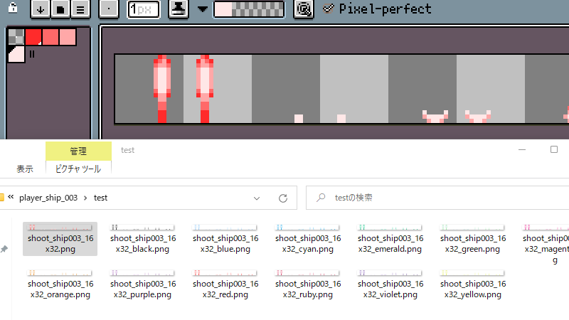
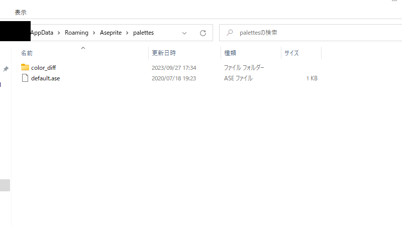
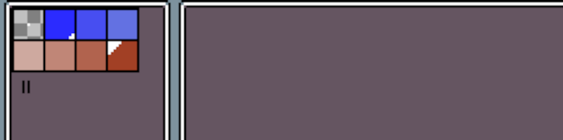
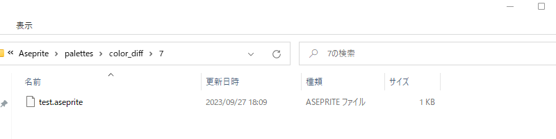

# Export Sprite Color Difference



[Aseprite](https://www.aseprite.org/)用の出力拡張機能です。

インデックス形式で作成したスプライトに別のパレット情報を適用し、色差分を一括出力します。

<span style="color: red; ">インデックス形式以外のスプライトには使用できません。</span>

<span style="color: red; ">スクリプトによるファイル操作を行うため、利用には信用権限の付与が必要です。</span>

<span style="color: red; ">自己責任で使用してください。</span>

-----

## 使い方

`Edit > Preferences > Locate Configuration File` を開き、paletts フォルダーの中にこのREADMEと同じフォルダーにある `color_diff` フォルダーをコピーします。



export-scd.aseprite-extensionを通常通りインストールします。

拡張機能のインストール後、`File > Export > Export Sprite Color Difference` から出力方法を選ぶことができます。

ソフト側の制限により、スクリプトを使用する際に信用権限を付与する必要があります。

設定終了後、条件に応じたスプライトの色差分がスプライトと同じフォルダに別名で出力されます。


<span style="color: red; ">この方法で出力された PNG ファイルは上書き確認されません。</span>

出力方法の詳細は以下を参照してください.

-----

## 出力方法

### Auto Index Size
単純なグラデーションを扱いたい場合、このタイプはあまり使わないと思います。

Auto Gradationのほうが適しています。

スプライトのインデックス数を基準に、自動的に使用するパレットを選択します。

この拡張機能には2色+1背景色のパレットしか付属していません。

3色以上のスプライトでこの出力方法を使用する場合、自分でパレットを作成し保存しておく必要があります。

`パレットの追加方法`を参照してください。

-----

### Auto Gradation
単純なグラデーションを使用する場合に適しています。

スプライトのインデックス数に応じて2色のパレットからグラデーションを自動計算し、PNGファイルとして出力します。

テスト用として12のパレットが付属しています。

`パレットの追加方法`に書いてある方法で自力で追加可能です。

2色+1背景色のパレットファイルを`color_diff/2`フォルダー以下に保存してください。

-----

### Select Folder
自分で使用するパレットのあるフォルダーを指定します。

色差分出力に使用したいパレットが含まれるフォルダー内のいずれかのパレットを選択すると、そのフォルダー内のすべてのパレットが使用されます。

色違いの自機など、特定のスプライトのみに使用したいパレットがある場合に使用できます。

この出力方法を使用する場合はスプライトとパレットの色数が同じか注意してください。

予期せぬエラーの原因になります。

-----

## パレットの追加方法
Asepriteで追加したい色のパレットを作成し、`color_diff`フォルダーに`Save Palette`から保存します。

読み込み可能な拡張子は以下の7種類です。

``````
ase aseprite png act gpl hex pal
``````

パレットは背景色を除外した色数と同じフォルダーに保存します。

7色 + 1背景色の計8色のパレットの保存先フォルダーは、`color_diff/7`になります。





パレットのファイル名は、出力されるPNGファイルのファイル名の末尾に付与されます。

aa.png というスプライトに上記のパレットを使用した場合,出力されるファイル名は`aa_test.png`になります。
